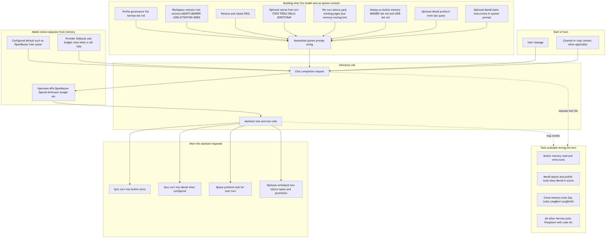
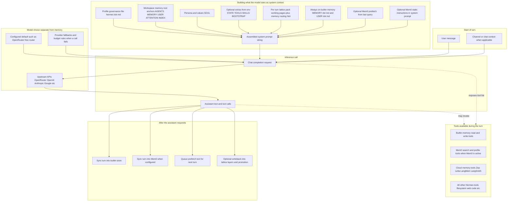
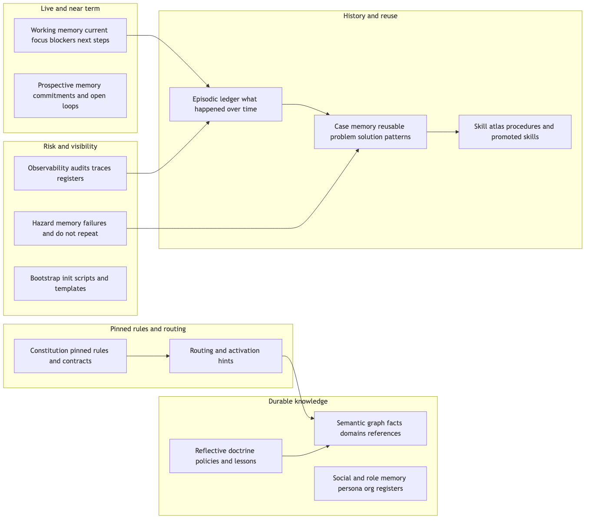
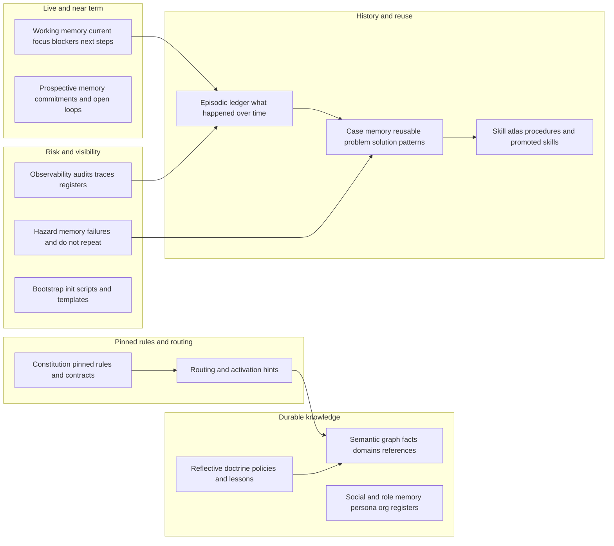
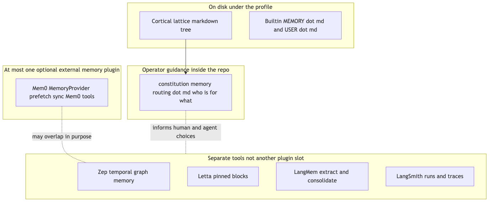
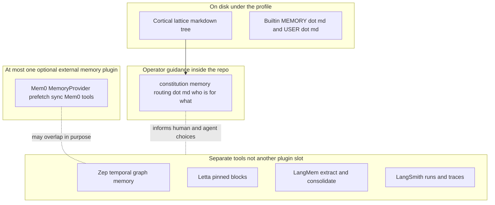

# Hermes memory architecture

Conceptual view of how Hermes assembles context and tools around the LLM call path: **model routing** (for example OpenRouter) is the inference API path; **memory** is what feeds the prompt or is invoked as tools—local Cortical Lattice markdown, built-in `MEMORY.md` / `USER.md`, optional **Mem0** as the single pluggable memory provider, and **Zep / Letta / LangMem / LangSmith** as explicit tools in `tools/cloud_memory_tool.py`. Routing intent for backends is also described in workspace `constitution/memory-routing.md` (when present).

**Pre-rendered images** (committed in this folder): PNG for quick viewing; SVG for lossless zoom. See [README.md](README.md) to regenerate.

| Diagram | PNG | SVG |
|---------|-----|-----|
| A — Full turn | [hermes-memory-turn-flow.png](hermes-memory-turn-flow.png) | [hermes-memory-turn-flow.svg](hermes-memory-turn-flow.svg) |
| B — Cortical lattice | [hermes-memory-cortical-lattice.png](hermes-memory-cortical-lattice.png) | [hermes-memory-cortical-lattice.svg](hermes-memory-cortical-lattice.svg) |
| C — External products | [hermes-memory-external-products.png](hermes-memory-external-products.png) | [hermes-memory-external-products.svg](hermes-memory-external-products.svg) |

---

## Diagram A — One full turn (from message to memory side effects)

*Vector:* [hermes-memory-turn-flow.svg](hermes-memory-turn-flow.svg)

Standalone Mermaid source: [hermes-memory-turn-flow.mmd](hermes-memory-turn-flow.mmd)

---

## Diagram B — Cortical lattice local layers and how they relate

Folders of markdown under workspace memory, not separate servers.

*Vector:* [hermes-memory-cortical-lattice.svg](hermes-memory-cortical-lattice.svg)

Standalone Mermaid source: [hermes-memory-cortical-lattice.mmd](hermes-memory-cortical-lattice.mmd)

---

## Diagram C — External memory products versus local files

Who is a plugin, who is tools-only, and where routing intent is written.

*Vector:* [hermes-memory-external-products.svg](hermes-memory-external-products.svg)

Standalone Mermaid source: [hermes-memory-external-products.mmd](hermes-memory-external-products.mmd)
